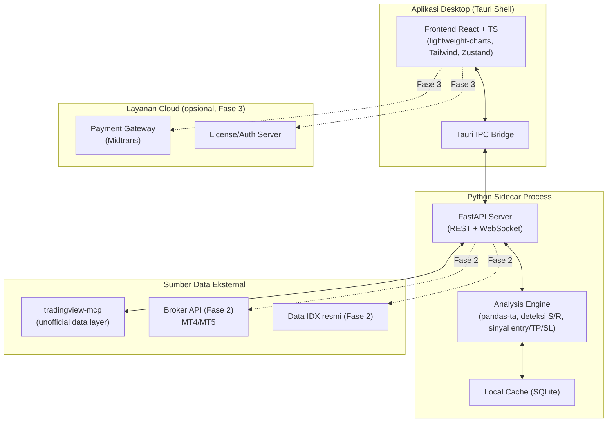

# PRD: TradeSight — SaaS Trading Assistant Desktop (Forex & Saham Indonesia)

**Versi Dokumen:** 2.0
**Status:** Draft teknis — siap dipakai sebagai acuan implementasi (Claude Code)
**Tanggal:** 27 September 2026
**Pemilik Produk:** —

> Catatan: "TradeSight" adalah nama kerja sementara — ganti sesuai brand yang kamu pilih. Semua angka target di dokumen ini adalah estimasi awal yang perlu divalidasi setelah beta.

---

## 1. Ringkasan Eksekutif

TradeSight adalah aplikasi desktop (Windows & macOS) yang membantu trader ritel forex dan saham Indonesia (IDX) mengambil keputusan trading lebih cepat dan lebih disiplin. Aplikasi menampilkan chart realtime, mendeteksi level support & resistance secara otomatis, menghitung sinyal teknikal (RSI, MACD, MA, dll), dan menyarankan level entry, take profit (TP), serta stop loss (SL) berbasis risk-reward yang jelas — tanpa trader perlu membuka banyak tab indikator manual.

Produk dibangun dengan stack open-source/gratis agar bisa diluncurkan tanpa modal produksi besar, lalu dimonetisasi lewat model freemium.

## 2. Latar Belakang & Masalah

- Trader ritel Indonesia (forex & saham) sering kesulitan menentukan level entry/TP/SL secara konsisten karena analisa manual memakan waktu dan rawan bias emosional.
- Tool analisa teknikal yang komprehensif (screener + indikator + auto S/R) umumnya berbayar mahal atau berbasis web/cloud yang bergantung koneksi platform pihak ketiga.
- Belum banyak aplikasi desktop ringan, native, yang menggabungkan data forex **dan** saham IDX dalam satu tampilan dengan sinyal actionable (bukan sekadar chart mentah).

## 3. Tujuan Produk

1. Membantu trader menentukan entry, TP, SL dalam hitungan detik berdasarkan analisa objektif (bukan feeling).
2. Menyediakan visualisasi support/resistance dan indikator teknikal realtime dalam satu layar.
3. Menjadi produk SaaS yang bisa mulai menghasilkan revenue dengan biaya produksi awal mendekati nol.
4. Membangun basis pengguna forex + saham Indonesia sebagai diferensiasi dari tool asing yang biasanya hanya fokus forex/crypto.

## 4. Target Pengguna

| Persona | Deskripsi | Kebutuhan Utama |
|---|---|---|
| Trader Forex Harian | Trading intraday/swing di pair mayor (EUR/USD, GBP/USD, XAU/USD) | Sinyal cepat, S/R akurat, notifikasi level tersentuh |
| Trader Saham IDX Ritel | Swing/positioning di saham blue-chip & second liner IDX | Screener saham, analisa teknikal harian, tracking watchlist |
| Trader Pemula | Baru belajar teknikal analisa | Tampilan sederhana, penjelasan "kenapa" di balik sinyal |

## 5. Ruang Lingkup

### 5.1 MVP (Fase 1)
- Dukungan 5 pair forex populer + 10 saham IDX blue-chip (watchlist tetap, belum full screener).
- Chart realtime/near-realtime dengan candlestick, volume.
- Deteksi otomatis support & resistance (metode pivot/swing high-low).
- Indikator dasar: MA, RSI, MACD.
- Sinyal entry + TP + SL dengan rasio risk-reward minimal 1:2, ditampilkan sebagai overlay di chart.
- Disclaimer risiko & legal di setiap sinyal.
- Aplikasi desktop installer untuk Windows (.exe) dan macOS (.dmg).

### 5.2 Fase 2 (Pasca-validasi)
- Screener saham & forex custom (filter berdasarkan indikator).
- Notifikasi realtime (desktop notification) saat level entry/TP/SL tersentuh.
- Multi-timeframe analysis (1H, 4H, Daily sekaligus).
- Riwayat & jurnal trading otomatis (log posisi yang diikuti user).

### 5.3 Fase 3 (Scale)
- Backtesting strategi custom oleh user.
- Integrasi eksekusi order ke broker (opsional, butuh kemitraan resmi).
- Versi mobile companion (opsional).

### 5.4 Di Luar Ruang Lingkup (saat ini)
- Bukan robot/auto-trading (tidak eksekusi order otomatis di MVP).
- Bukan platform edukasi trading penuh (kelas, sertifikasi).
- Bukan penyedia rekomendasi investasi berlisensi (lihat Bagian 15).

## 6. Fitur Detail (User Stories)

| ID | User Story | Prioritas |
|---|---|---|
| F1 | Sebagai trader, saya ingin melihat chart candlestick realtime untuk pair/saham pilihan saya | Must |
| F2 | Sebagai trader, saya ingin sistem menandai level support & resistance otomatis di chart | Must |
| F3 | Sebagai trader, saya ingin melihat saran entry, TP, SL dengan rasio risk-reward yang ditampilkan jelas | Must |
| F4 | Sebagai trader, saya ingin melihat indikator RSI/MACD/MA tanpa setup manual | Must |
| F5 | Sebagai trader, saya ingin menyimpan watchlist pair/saham favorit saya | Should |
| F6 | Sebagai trader, saya ingin mendapat notifikasi saat harga mendekati level penting | Could (Fase 2) |
| F7 | Sebagai trader, saya ingin melihat riwayat sinyal yang pernah muncul untuk evaluasi | Could (Fase 2) |
| F8 | Sebagai admin produk, saya ingin membatasi fitur premium di balik paywall | Must |

## 7. Arsitektur Teknis

**Prinsip:** semua komponen dipilih dari tool gratis/open-source agar biaya produksi ≈ Rp0 di tahap awal.

- **Desktop shell:** Tauri (lebih ringan dari Electron, binary lebih kecil, tetap cross-platform Windows/macOS).
- **Frontend/UI:** React + TypeScript + lightweight-charts (library chart open-source dari TradingView) untuk rendering candlestick & overlay sinyal.
- **Styling:** Tailwind CSS (utility-first, cepat untuk konsistensi desain system).
- **State management:** Zustand (ringan, lebih sederhana dari Redux untuk skala app ini).
- **Backend lokal:** Python service (FastAPI, jalan sebagai sidecar process di dalam app) untuk data fetching, kalkulasi indikator (pandas-ta), dan logika deteksi S/R + sinyal.
- **Sumber data:** MCP server tradingview-mcp (unofficial, open-source, gratis) sebagai data layer awal — lihat Bagian 9 untuk risiko.
- **Komunikasi UI ↔ backend:** REST API untuk data on-demand, WebSocket lokal (localhost) untuk update harga realtime.
- **Build & distribusi:** GitHub Actions (gratis untuk repo publik/tier gratis) untuk compile otomatis ke `.exe` dan `.dmg`.
- **Lisensi & billing (Fase MVP monetisasi):** integrasi payment gateway lokal (mis. Midtrans) untuk model freemium, hanya diaktifkan setelah traksi awal.

### 7.1 Skema Arsitektur Sistem



### 7.2 Alur Data (Data Flow)

1. User membuka pair/saham dari watchlist di UI.
2. UI kirim request ke FastAPI sidecar lewat REST (historical data) dan subscribe WebSocket (update realtime).
3. Sidecar menarik data dari `tradingview-mcp`, simpan sementara di cache lokal (SQLite/in-memory).
4. Analysis Engine menghitung indikator (RSI/MACD/MA), mendeteksi S/R, dan menghasilkan sinyal entry/TP/SL.
5. Hasil dikirim balik ke UI lewat WebSocket, dirender sebagai overlay di chart (lightweight-charts) dan Signal Card di panel kanan.
6. Setiap update harga baru mengulang langkah 4–5 secara incremental (bukan hitung ulang total) untuk menjaga performa realtime.

### 7.3 Komunikasi Antar Komponen

| Dari | Ke | Protokol | Contoh Payload |
|---|---|---|---|
| UI | Sidecar | REST `GET /instruments/{symbol}/history` | Data OHLCV historis |
| UI | Sidecar | WebSocket `ws://localhost:PORT/stream/{symbol}` | Update harga & sinyal realtime |
| Sidecar | tradingview-mcp | MCP tool call | `get_historical_data`, `get_indicators` |
| UI | Tauri Core | IPC command | Notifikasi native, akses filesystem lokal |

## 8. Susunan Proyek (Project Structure)

Struktur monorepo agar Claude Code bisa bekerja di frontend dan backend dalam satu repo tanpa konteks tercecer:

```
tradesight/
├── apps/
│   └── desktop/                     # Aplikasi Tauri
│       ├── src/                     # Frontend React + TypeScript
│       │   ├── components/
│       │   │   ├── chart/
│       │   │   │   ├── ChartPanel.tsx
│       │   │   │   ├── SignalOverlay.tsx
│       │   │   │   └── IndicatorToggle.tsx
│       │   │   ├── watchlist/
│       │   │   │   ├── WatchlistSidebar.tsx
│       │   │   │   └── WatchlistItem.tsx
│       │   │   ├── signal/
│       │   │   │   └── SignalCard.tsx
│       │   │   ├── common/
│       │   │   │   ├── Button.tsx
│       │   │   │   ├── Modal.tsx
│       │   │   │   └── LoadingSkeleton.tsx
│       │   │   └── layout/
│       │   │       ├── AppShell.tsx
│       │   │       └── TopBar.tsx
│       │   ├── screens/
│       │   │   ├── DashboardScreen.tsx
│       │   │   ├── OnboardingScreen.tsx
│       │   │   ├── SettingsScreen.tsx
│       │   │   └── PaywallScreen.tsx
│       │   ├── stores/              # Zustand state
│       │   │   ├── useWatchlistStore.ts
│       │   │   ├── useChartStore.ts
│       │   │   └── useUserStore.ts
│       │   ├── services/
│       │   │   ├── api.ts           # REST client
│       │   │   └── wsClient.ts      # WebSocket client
│       │   ├── styles/
│       │   │   └── tokens.css       # design tokens (warna, spacing)
│       │   ├── App.tsx
│       │   └── main.tsx
│       ├── src-tauri/               # Konfigurasi native Tauri
│       │   ├── src/main.rs
│       │   ├── tauri.conf.json
│       │   └── icons/
│       ├── public/
│       ├── package.json
│       └── tsconfig.json
│
├── services/
│   └── sidecar/                     # Backend Python (FastAPI)
│       ├── app/
│       │   ├── main.py              # entrypoint FastAPI
│       │   ├── api/
│       │   │   ├── routes_instruments.py
│       │   │   └── routes_ws.py
│       │   ├── engine/
│       │   │   ├── indicators.py    # RSI, MACD, MA (pandas-ta)
│       │   │   ├── support_resistance.py
│       │   │   └── signal_generator.py  # logika entry/TP/SL
│       │   ├── data/
│       │   │   ├── mcp_client.py    # koneksi ke tradingview-mcp
│       │   │   └── cache.py
│       │   └── models/
│       │       └── schemas.py       # Pydantic models
│       ├── tests/
│       ├── requirements.txt
│       └── pyproject.toml
│
├── docs/
│   ├── PRD.md                       # dokumen ini
│   └── architecture-decisions/
│
├── .github/
│   └── workflows/
│       └── build-release.yml        # CI build .exe & .dmg
│
├── .gitignore
└── README.md
```

**Konvensi penamaan:**
- Komponen React: PascalCase (`SignalCard.tsx`).
- Hook/store Zustand: prefix `use` (`useWatchlistStore.ts`).
- Modul Python: snake_case (`support_resistance.py`).
- Setiap fitur baru dari Bagian 6 (F1–F8) dipetakan ke folder terkait agar mudah dilacak saat implementasi.

## 9. Sumber Data & Risiko Teknis

| Sumber | Status | Risiko | Mitigasi |
|---|---|---|---|
| tradingview-mcp (unofficial) | Gratis, open-source, scraping-based | Bisa berhenti berfungsi jika TradingView ubah struktur situs; berpotensi melanggar ToS TradingView jika dipakai komersial skala besar | Gunakan untuk MVP/riset dulu; siapkan rencana migrasi ke data resmi (broker API/vendor bursa) sebelum scale-up |
| Data broker forex (MT4/MT5 API) | Gratis untuk demo/live account tertentu | Tergantung ketersediaan broker partner | Evaluasi di Fase 2 sebagai sumber data resmi forex |
| Data IDX resmi | Umumnya berbayar atau delay 15-20 menit untuk versi gratis | Data delay tidak ideal untuk intraday | Gunakan delay data dulu, beri label jelas "delayed data" ke user |

## 10. Spesifikasi UI/UX

### 10.1 Design Tokens

| Token | Nilai | Catatan |
|---|---|---|
| `--bg-primary` | `#0B0E14` | Latar utama, dark mode default |
| `--bg-surface` | `#141821` | Panel/card |
| `--border-subtle` | `#232833` | Garis pembatas panel |
| `--accent-buy` | `#22C55E` | Warna entry/sinyal beli |
| `--accent-tp` | `#3B82F6` | Warna take profit |
| `--accent-sl` | `#EF4444` | Warna stop loss |
| `--text-primary` | `#E5E7EB` | Teks utama |
| `--text-muted` | `#8B92A3` | Teks sekunder/label |
| Font utama | `Inter` atau `IBM Plex Sans` | Mudah dibaca di angka kecil (harga) |
| Font angka/harga | `IBM Plex Mono` atau `JetBrains Mono` | Monospace agar digit sejajar, umum dipakai app trading |
| Radius | `8px` (card), `4px` (button) | Konsisten di semua komponen |
| Spacing base | `4px` grid (4/8/12/16/24/32) | — |

### 10.2 Struktur Layar (Screens)

| Layar | Fungsi | Komponen Utama |
|---|---|---|
| Onboarding | Perkenalan singkat + disclaimer risiko wajib dibaca | 3 slide swipe, tombol "Saya Mengerti" |
| Dashboard (utama) | Watchlist + chart + panel sinyal dalam satu layar | `WatchlistSidebar`, `ChartPanel`, `SignalCard`, `IndicatorToggle` |
| Detail Instrumen | Chart fullscreen + histori sinyal untuk 1 pair/saham | `ChartPanel` (expanded), riwayat sinyal (Fase 2) |
| Settings | Pengaturan tema, notifikasi, akun/langganan | Toggle list, tombol logout |
| Paywall | Upsell dari free ke premium | Perbandingan fitur, tombol upgrade |

### 10.3 Layout Dashboard (Wireframe Deskriptif)

```
┌─────────────────────────────────────────────────────────────────┐
│ TopBar: Logo | Search instrumen | Status koneksi data | Avatar   │
├───────────────┬─────────────────────────────────┬───────────────┤
│               │                                 │               │
│  Watchlist    │        ChartPanel               │  SignalCard   │
│  Sidebar      │  (candlestick + overlay S/R      │  - Entry      │
│  - EUR/USD    │   + garis entry/TP/SL)           │  - TP (RR)    │
│  - XAU/USD    │                                  │  - SL         │
│  - BBCA       │  [Toolbar timeframe: 15m 1H 4H D]│  IndicatorPanel│
│  - ...        │                                  │  - RSI        │
│               │                                  │  - MACD       │
│  [+ Tambah]   │                                  │  - MA         │
├───────────────┴─────────────────────────────────┴───────────────┤
│ Footer: Disclaimer singkat "Bukan rekomendasi investasi"         │
└─────────────────────────────────────────────────────────────────┘
```

- Sidebar kiri: lebar tetap ~240px, scroll independen dari chart.
- Panel chart tengah: mengisi sisa ruang (flex-grow), responsif saat window di-resize.
- Panel kanan: lebar tetap ~280px, berisi ringkasan sinyal aktif + indikator dalam bentuk angka/gauge kecil.

### 10.4 Komponen UI Utama

| Komponen | Deskripsi | State penting |
|---|---|---|
| `ChartPanel` | Wrapper lightweight-charts, render candlestick + overlay | loading, live, error (data gagal fetch) |
| `SignalCard` | Ringkasan sinyal aktif (entry/TP/SL, rasio RR) | no-signal, active-signal, signal-hit |
| `WatchlistItem` | Baris instrumen di sidebar dengan harga & perubahan % | up, down, neutral |
| `IndicatorToggle` | Checkbox untuk aktif/nonaktifkan indikator di chart | on/off per indikator |
| `LoadingSkeleton` | Placeholder saat data belum tersedia | — |
| `PaywallModal` | Modal upsell saat user free coba akses fitur premium | — |

## 11. Animasi UI

Prinsip: animasi halus dan cepat (150–300ms), tidak mengganggu pembacaan data realtime. Hindari animasi berlebihan di elemen yang update sangat sering (harga live) agar tidak melelahkan mata.

| Elemen | Animasi | Durasi & Easing |
|---|---|---|
| Perpindahan layar (Dashboard ↔ Settings) | Fade + slight slide-up (8px) | 200ms, `ease-out` |
| Sinyal baru muncul di chart (garis entry/TP/SL) | Garis muncul dengan fade-in + sedikit "draw" dari kiri ke kanan | 300ms, `ease-in-out` |
| Harga watchlist berubah (naik/turun) | Flash warna singkat (hijau/merah) pada angka, lalu kembali normal | 400ms flash, fade balik 300ms |
| Hover pada `WatchlistItem` / tombol | Scale 1.0 → 1.02 + perubahan warna background | 150ms, `ease-out` |
| Loading data chart | Skeleton shimmer (gradient bergerak) | loop 1.2s |
| Toast notifikasi (level tersentuh, Fase 2) | Slide-in dari kanan atas + fade | masuk 250ms, bertahan 4s, keluar 200ms |
| Buka `PaywallModal` | Scale dari 0.96 → 1.0 + backdrop fade | 200ms, `ease-out` |
| Onboarding slide | Horizontal swipe/transition antar slide | 300ms, `ease-in-out` |

**Catatan implementasi:** gunakan CSS transitions/Framer Motion secukupnya di React; hindari re-render animasi pada komponen yang menerima update WebSocket berfrekuensi tinggi (pisahkan komponen angka harga dari komponen chart agar animasi flash tidak memicu re-render seluruh chart).

## 12. Model Bisnis & Monetisasi

- **Freemium:**
  - Gratis: watchlist terbatas (5 instrumen), sinyal dasar, data delay.
  - Premium (berlangganan bulanan): watchlist unlimited, data lebih realtime, notifikasi, multi-timeframe, jurnal trading.
- **Estimasi harga awal:** kompetitif di bawah tool sejenis internasional, disesuaikan daya beli trader ritel Indonesia (perlu riset harga kompetitor sebelum finalisasi).
- **Biaya produksi awal:** mendekati Rp0 (semua tool dev gratis); biaya baru muncul saat scale (hosting data resmi, payment gateway fee, server notifikasi).

## 13. Kepatuhan Hukum & Disclaimer

- Aplikasi **bukan** penyedia rekomendasi investasi berlisensi OJK — semua sinyal harus diberi label eksplisit sebagai "alat bantu analisa teknikal", bukan "rekomendasi beli/jual".
- Disclaimer risiko wajib ditampilkan saat onboarding dan di setiap sinyal: trading forex & saham mengandung risiko kerugian, keputusan akhir ada di tangan pengguna.
- Untuk data yang bersumber dari scraping unofficial, hindari klaim "data resmi TradingView" dalam materi pemasaran — gunakan istilah netral seperti "data pasar realtime".
- Sebelum listing di app store resmi atau kampanye marketing besar, disarankan konsultasi hukum ringan terkait posisi produk sebagai "tools", bukan "advisor".

## 14. Metrik Keberhasilan (KPI)

| Metrik | Target Awal (3 bulan pasca-launch) |
|---|---|
| Jumlah unduhan aktif | 500–1.000 pengguna |
| Konversi free → premium | 3–5% |
| Retensi 30 hari | ≥ 25% |
| Rating aplikasi (jika didistribusikan lewat platform) | ≥ 4.0/5.0 |

*(Semua angka di atas adalah estimasi awal untuk perencanaan, bukan komitmen — sesuaikan dengan data traksi nyata.)*

## 15. Roadmap & Milestone

| Fase | Fokus | Estimasi Durasi |
|---|---|---|
| Fase 0 | Setup data layer (tradingview-mcp) & validasi data forex + IDX | 1–2 minggu |
| Fase 1 (MVP) | Engine analisa teknikal + UI dasar + build installer Win/Mac | 4–6 minggu |
| Fase 2 (Beta tertutup) | Undang trader beta, kumpulkan feedback, perbaiki akurasi sinyal | 2–4 minggu |
| Fase 3 (Launch freemium) | Aktifkan payment gateway, buka pendaftaran publik | 1–2 minggu |
| Fase 4 | Screener, notifikasi, multi-timeframe, migrasi ke data resmi | Berkelanjutan |

## 16. Risiko & Mitigasi

| Risiko | Dampak | Mitigasi |
|---|---|---|
| Sumber data unofficial berhenti berfungsi | Tinggi | Desain data layer modular agar mudah ganti sumber data |
| Akurasi sinyal rendah menurunkan kepercayaan user | Tinggi | Uji backtest sinyal sebelum rilis publik, tampilkan disclaimer jelas |
| Isu legal terkait "rekomendasi investasi" | Sedang-Tinggi | Positioning ketat sebagai "tools analisa", bukan "advisor" |
| Kompetisi dari tool internasional established | Sedang | Diferensiasi lewat fokus saham Indonesia + harga lokal |

## 17. Panduan Implementasi untuk Claude Code

Urutan pengerjaan yang disarankan agar setiap langkah bisa diuji sebelum lanjut:

1. **Scaffold repo** sesuai struktur di Bagian 8 (`apps/desktop`, `services/sidecar`).
2. **Bangun sidecar dulu** (`services/sidecar`): setup FastAPI, koneksi ke `tradingview-mcp`, endpoint `GET /instruments/{symbol}/history` mengembalikan data dummy dulu → lalu data asli.
3. **Implementasi Analysis Engine**: mulai dari indikator dasar (MA/RSI/MACD) pakai `pandas-ta`, baru lanjut ke deteksi support/resistance dan `signal_generator.py`.
4. **Tambahkan WebSocket endpoint** untuk streaming update harga + sinyal.
5. **Scaffold frontend Tauri + React**, mulai dari `AppShell` dan `DashboardScreen` dengan data dummy dari sidecar.
6. **Integrasikan `ChartPanel`** dengan lightweight-charts, render candlestick dari data sidecar.
7. **Tambahkan overlay sinyal** (`SignalOverlay`, `SignalCard`) sesuai warna & animasi di Bagian 10–11.
8. **Uji end-to-end** dengan 1–2 instrumen dulu (misal EUR/USD, BBCA) sebelum expand ke seluruh watchlist MVP.
9. **Setup CI** (`.github/workflows/build-release.yml`) untuk build `.exe`/`.dmg` otomatis.
10. Fitur premium/paywall dikerjakan **paling akhir**, setelah alur inti (F1–F4) stabil.

## 18. Build & Packaging ke Installer (.exe / .dmg)

Instruksi ini untuk Claude Code agar hasil akhir langsung berupa file installer yang bisa diklik-install oleh user, bukan cuma source code.

### 18.1 Konfigurasi Bundler di `tauri.conf.json`

Tauri sudah punya bundler bawaan (NSIS untuk Windows, DMG untuk macOS) — cukup diaktifkan dan dikonfigurasi, tidak perlu tool tambahan:

```json
{
  "bundle": {
    "active": true,
    "targets": ["nsis", "dmg"],
    "identifier": "com.tradesight.app",
    "windows": {
      "nsis": {
        "installMode": "perMachine",
        "languages": ["English", "Indonesian"],
        "displayLanguageSelector": true
      }
    },
    "macOS": {
      "minimumSystemVersion": "10.15"
    }
  }
}
```

- `targets: ["nsis"]` menghasilkan **satu file `.exe` installer** (bukan cuma `.msi`) yang berisi wizard install standar Windows (Next → Install → Finish).
- `targets: ["dmg"]` menghasilkan file `.dmg` untuk macOS yang tinggal drag-and-drop ke folder Applications.

### 18.2 Perintah Build

```bash
# Build sekali jalan untuk platform saat ini
npm run tauri build

# Hasil installer otomatis muncul di:
# Windows: src-tauri/target/release/bundle/nsis/TradeSight_<versi>_x64-setup.exe
# macOS:   src-tauri/target/release/bundle/dmg/TradeSight_<versi>_x64.dmg
```

Build untuk Windows **wajib** dijalankan di mesin Windows (atau lewat CI di Bagian 18.3) karena NSIS bundler butuh environment Windows; build macOS wajib di mesin macOS/CI macOS.

### 18.3 GitHub Actions — Build Otomatis Lintas Platform (Gratis)

Karena Claude Code kemungkinan jalan di satu OS saja, gunakan CI untuk build `.exe` dan `.dmg` sekaligus tanpa perlu komputer Windows/Mac fisik:

```yaml
# .github/workflows/build-release.yml
name: Build Release
on:
  push:
    tags: ["v*"]

jobs:
  build:
    strategy:
      matrix:
        include:
          - platform: windows-latest
            target: nsis
          - platform: macos-latest
            target: dmg
    runs-on: ${{ matrix.platform }}
    steps:
      - uses: actions/checkout@v4
      - uses: actions/setup-node@v4
        with:
          node-version: 20
      - uses: dtolnay/rust-toolchain@stable
      - name: Install frontend deps
        run: cd apps/desktop && npm install
      - name: Build Tauri app
        run: cd apps/desktop && npm run tauri build
      - name: Upload installer
        uses: actions/upload-artifact@v4
        with:
          name: tradesight-${{ matrix.platform }}
          path: |
            apps/desktop/src-tauri/target/release/bundle/nsis/*.exe
            apps/desktop/src-tauri/target/release/bundle/dmg/*.dmg
```

- Setiap push tag versi (`v1.0.0`, dst.) otomatis menghasilkan `.exe` dan `.dmg` yang bisa diunduh dari tab **Actions → Artifacts** di GitHub, gratis untuk repo publik atau tier gratis GitHub.
- File `.exe` hasil build ini **langsung bisa diklik dua kali untuk install** di Windows tanpa langkah tambahan dari user.

### 18.4 Catatan Penting: Windows SmartScreen

Karena aplikasi belum memakai code signing certificate berbayar, saat pertama kali dijalankan Windows akan menampilkan peringatan **"Windows protected your PC"**. Ini normal untuk aplikasi baru tanpa sertifikat dan tidak menghalangi instalasi — user tinggal klik **"More info" → "Run anyway"**. Opsi untuk menghilangkan peringatan ini di masa depan (opsional, berbayar):

- Beli code signing certificate (mis. dari SignPath, Certum) — mulai sekitar $100–300/tahun.
- Alternatif gratis sementara: cantumkan instruksi singkat di halaman download ("klik More info → Run anyway") sampai traksi cukup untuk beli sertifikat.

### 18.5 Checklist Sebelum Rilis Installer

1. Update versi di `tauri.conf.json` (`"version": "x.y.z"`) — versi ini otomatis masuk ke nama file `.exe`/`.dmg`.
2. Pastikan ikon app (`icons/icon.ico` untuk Windows, `icon.icns` untuk macOS) sudah diset di `src-tauri/icons/`.
3. Jalankan `npm run tauri build` secara lokal minimal sekali untuk cek tidak ada error sebelum push tag ke CI.
4. Push tag versi (`git tag v1.0.0 && git push --tags`) untuk memicu build otomatis di GitHub Actions.
5. Unduh artifact `.exe`/`.dmg` dari GitHub Actions, uji install di mesin bersih sebelum dibagikan ke user/beta tester.

## 19. Asumsi & Pertanyaan Terbuka

- Asumsi: pengguna awal adalah trader yang sudah familiar dasar teknikal analisa (bukan edukasi dari nol).
- Pertanyaan terbuka: apakah perlu dukungan broker/eksekusi order di masa depan, atau tetap murni tools analisa?
- Pertanyaan terbuka: strategi migrasi dari data unofficial ke data resmi — timing dan biayanya perlu direncanakan sebelum traksi besar.
- Pertanyaan terbuka: nama & branding final produk (saat ini masih "TradeSight" sebagai placeholder).
